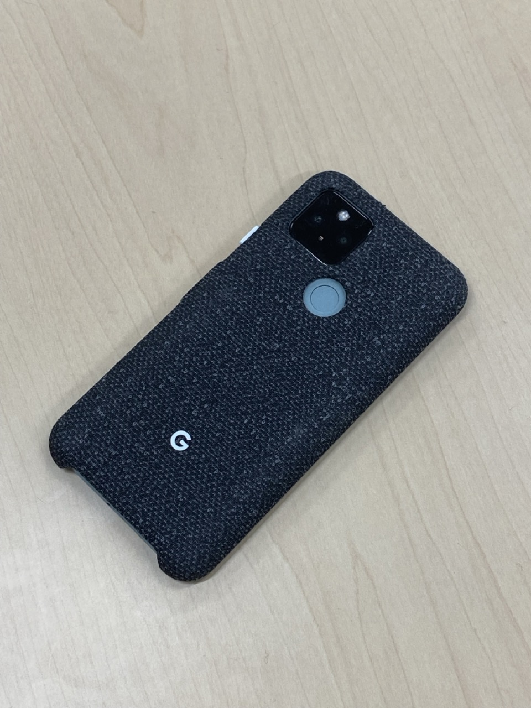
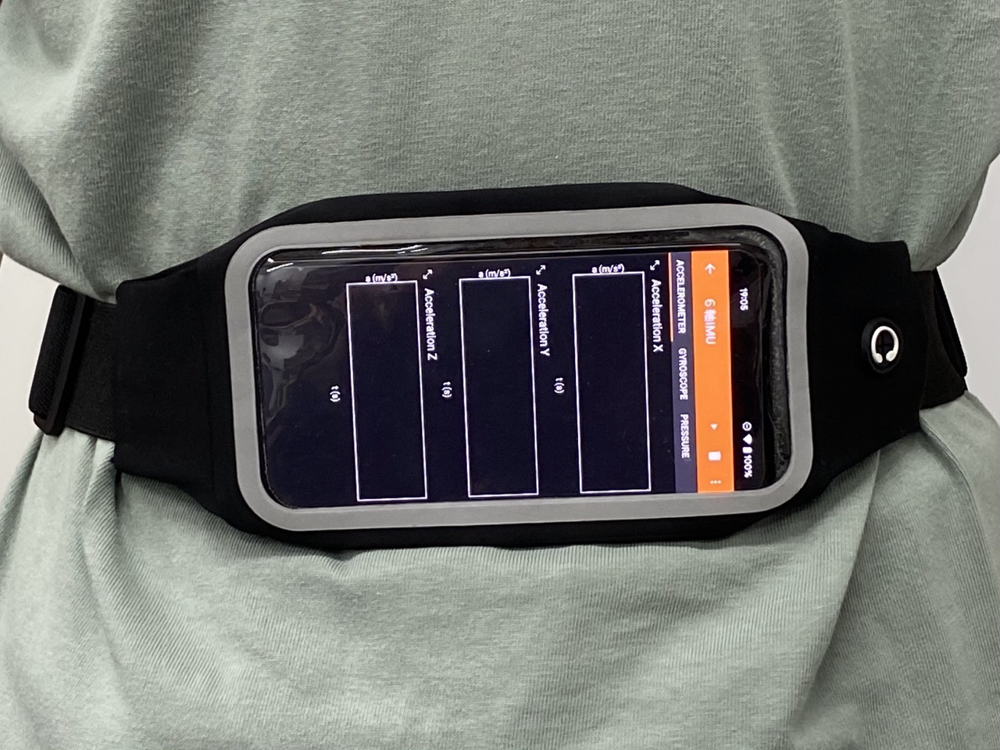

# kajilab-PDR

# 初期化

## ローカル環境

### 仮想環境の作成

```zsh
$ python -m venv .venv
```

### 仮想環境の有効化

```zsh
$ . .venv/bin/activate
```

### ライブラリのインポート

```zsh
$ pip install -r requirements.txt
```

## Colab

https://colab.research.google.com/github/kanakanho/kajilab-PDR/blob/main/main.ipynb

# 実験について

## 実験に使った端末

**Pixel5**



## センシングの方法


